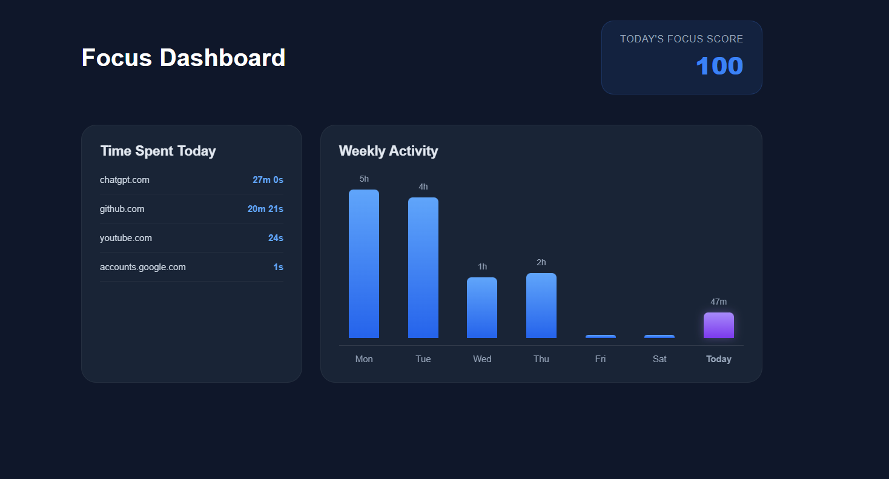
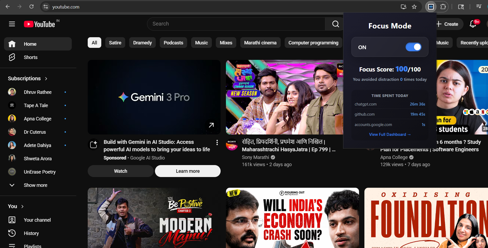

# 🚀 Focus Mode — Chrome Productivity Extension

Focus Mode is a modern Chrome extension designed to help users improve productivity by tracking browsing activity, analyzing focus patterns, and generating a real-time focus score.

The extension provides a clean dashboard with weekly analytics, website tracking, and productivity insights — all stored locally using Chrome Storage APIs.

---

## ✨ Features

- ⏱️ Real-time website usage tracking
- 📊 Weekly activity dashboard
- 🎯 Dynamic Focus Score (0–100)
- 🧠 Productive vs Distracting website analysis
- 💾 Local data persistence using Chrome Storage
- 🌙 Modern dark-themed UI
- 📅 Weekly analytics visualization (Mon–Sun)
- ⚡ Lightweight and optimized performance
- 🔒 Fully client-side (No backend required)

---

## 🖼️ Screenshots

### Dashboard


### Popup UI


---

## 🛠️ Tech Stack

- HTML5
- CSS3
- JavaScript
- Chrome Extension APIs
- Chrome Storage API

---

## 📂 Project Structure

```bash
├── manifest.json
├── content.js
├── popup.html
├── popup.css
├── popup.js
├── dashboard.html
├── dashboard.css
├── dashboard.js
├── migration.js
├── icon16.png
├── icon32.png
├── icon48.png
├── icon128.png
├── dashboard.png
├── popup.png
├── LICENSE
├── .gitignore
└── README.md
```

## ⚙️ Installation

1. Clone or download this repository

```bash
git clone https://github.com/kartikindusane05-droid/focus-mode-extension.git
```

2. Open Chrome and go to:

```bash
chrome://extensions/
```

3. Enable **Developer Mode**

4. Click **Load Unpacked**

5. Select the project folder

6. Extension is ready to use ✅

---

## 🧠 How It Works

- The extension tracks active website usage time
- Data is stored locally using `chrome.storage.local`
- Websites are categorized as:
  - Productive
  - Distracting
  - Neutral
- A weighted algorithm calculates the user's Focus Score
- Dashboard visualizes weekly productivity analytics

---

## 🎯 Future Improvements

- Export analytics reports
- Pomodoro timer integration
- Goal-based productivity tracking
- Cloud sync support
- AI-powered focus recommendations

---

## 🤝 Contributing

Contributions, suggestions, and improvements are welcome.

Feel free to fork this repository and submit a pull request.

---

## 📜 License

This project is licensed under the MIT License.

---

## 👨‍💻 Author

Developed by Kartiki Dusane — 2nd Year IT Engineering Student
